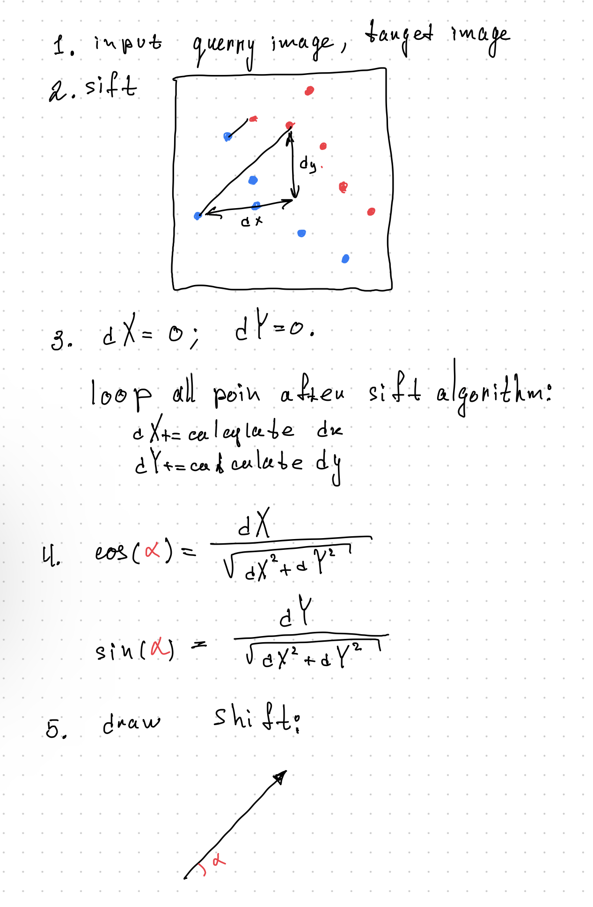

# shifter [https://github.com/kodinkod/shifter/blob/main/detect_shift.ipynb](notebook)
A way to determine the direction in which you need to move the image so that the image matches the specified image. Use SIFT technology.

## Quickstart
Place the image in the "data" folder query_1.jpg and target_1.jpg -> run detect_shift.ipynb

## Description 
1. use sift for detect keypoint on target and querry image.
2. use knnMather; Match target keypoint and querry keypoint.
3. Calculate dX=sum(dx1, dx2, .. ), dY=sum(dy1, dy2, .. ) ->cos, sin, and show shift.

keypoint = (x, y)

dx = x2-x1; x2 - target x, x1 - target y;

## More test

